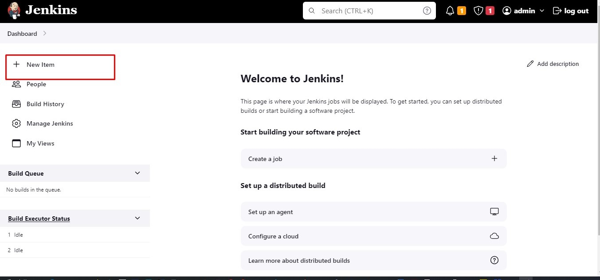
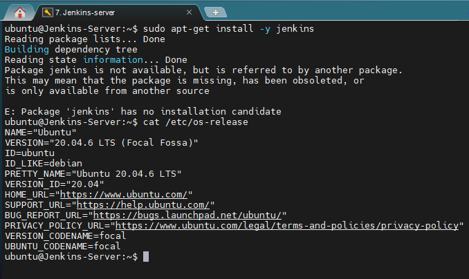
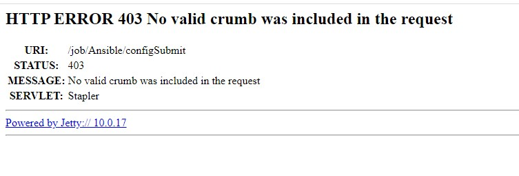
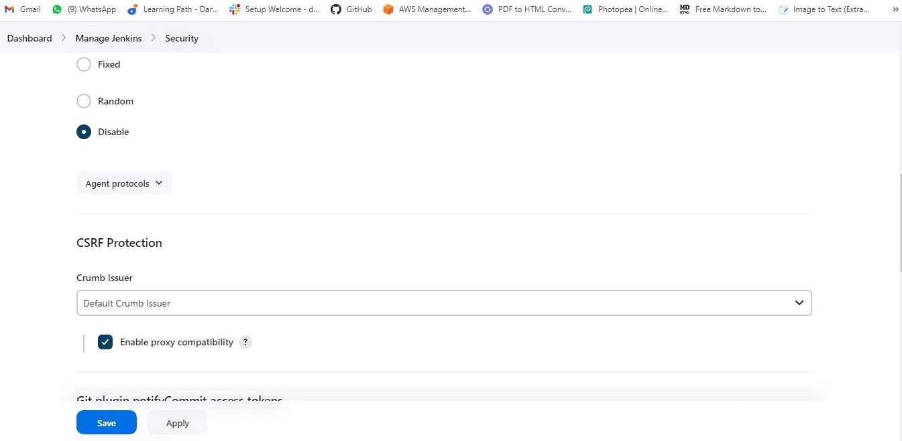

# Ansible - Automate Project

## Step 1. Install and Configure Jenkins and Ansible on EC2

1. Create an AWS EC2 Server Instance running Ubuntu OS (Jenkins-Server)

   _Use the commands to change the name of your instance_

   `sudo vi /etc/hostname`
   `sudo reboot`

2. Install JDK (Since Jenkins is a Java-based application)

```
sudo apt update
sudo apt install openjdk-11-jre

#Confirm Java installation
java -version
```


3. Install Jenkins. You can refer to the official [Jenkins Documentation](https://www.jenkins.io/doc/book/installing/linux/#debianubuntu)

```
curl -fsSL https://pkg.jenkins.io/debian/jenkins.io-2023.key | sudo tee \
/usr/share/keyrings/jenkins-keyring.asc > /dev/null

echo deb [signed-by=/usr/share/keyrings/jenkins-keyring.asc] \
https://pkg.jenkins.io/debian binary/ | sudo tee \
/etc/apt/sources.list.d/jenkins.list > /dev/null

sudo apt-get update

sudo apt-get install -y jenkins

#Confirm Jenkins is up and running

sudo systemctl status jenkins
```


4. By default Jenkins server uses TCP port 8080. Open this port by creating a new Inbound Rule in your EC2 Security Group.


5. Perform initial Jenkins setup.

- From your browser access http://<Jenkins-Server-Public-IP-Address-or-Public-DNS-Name>:8080. You will be prompted for a default admin password.


- The default password can be retrieved with the command `sudo cat /var/lib/jenkins/secrets/initialAdminPassword`

- Install suggested plugins and that completes the installation of Jenkins.


6. In your GitHub account, create a new repository and name it `ansible-config-mgt`

7. Install Ansible

```
sudo apt update
sudo apt install ansible

# Check your ansible version
ansible --version
```


8. Configure Jenkins build job to archive your repository content every time you make a change to it.

- Create a new Freestyle project `ansible` in Jenkins and point it to your `ansible-config-mgt` repository.




- Configure a [webhook](https://www.blazemeter.com/blog/how-to-integrate-your-github-repository-to-your-jenkins-project) in GitHub and set the webhook to trigger ansible build.


- Configure a post-build job to save all `(**)` files.


9. Test your setup by making some change in `README.md` file in `master` branch and make sure that builds starts automatically and Jenkins saves the files (build artifacts) in the folder `ls /var/lib/jenkins/jobs/ansible/builds/<build_number>/archive/`


_Note: Trigger Jenkins project execution for main (or master) branch_

**Tip:** Every time you stop/start your `Jenkins-Server`, you have to reconfigure GitHub webhook to a new IP address. In order to avoid it, it makes sense to allocate an Elastic IP to your `Jenkins-Server`. Note that Elastic IP is free only when it is being allocated to an EC2 instance so do not forget to release Elastic IP once you terminate your EC2 instance.

## Step 2: Prepare the development environment using Visual Studio Code

1. The `Dev` in `DevOps` means you will be required to write some codes and should have proper tools to make your coding and debugging comfortable. You need an Integrated Development Environment (IDE). I will be using Visual Studio Code (VSC). It is free and versatile and will fully satisfy your development needs. You can download this amazing and powerful development tool by clicking right [here](https://code.visualstudio.com/Download).

2. After installing visual studio code, configure it to connect to your newly created GitHub repository.


Clone down your `ansible-config-mgt` repo to your Jenkins-Server instance
`git clone <ansible-config-mgt repo link>`


## Step 3: Begin Ansible Development

1. In the `ansible-config-mgt` GitHub repository, create a new branch that will be used for development of a new feature.

`git checkout -b new_feature`


2. Checkout the newly created feature branch to your local machine and start building your code and directory structure.

`git checkout -b new_feature`

3. Create a directory named `playbooks`. It will be used to store all your playbook files. `mkdir playbooks`

Create a directory named `inventory`. It will be used to keep your hosts organised. `mkdir inventory`

Within the `playbooks` folder, create your first playbook and name it `common.yml`

`cd playbooks`

`code common.yml`

6. Within the `inventory folder`, create an inventory file for each environment (Development, Staging, Testing and Production) named `dev`, `staging`, `uat` and `prod` respectively. These files use `.ini` languages style to configure Ansible hosts.


## Step 4: Set up an Ansible Inventory

An Ansible inventory file defines the hosts and groups of hosts upon which commands, modules, and tasks in a playbook operate. Since our intention is to execute Linux commands on remote hosts, and ensure that it is the intended configuration on a particular server that occurs. It is important to have a way to organize our hosts in such an Inventory.

1. Save the below inventory structure in the `inventory/dev` file to start configuring your development servers. Ensure to replace the IP addresses according to your own setup.

**Note:** Ansible uses TCP port 22 by default, which means it needs to `ssh` into target servers from Jenkins-Ansible host. For this we can implement the concept of `ssh-agent`. Now you need to import key into `ssh-agent`

```
eval `ssh-agent -s`
ssh-add <path-to-private-key>
```

2. Confirm the key has been added with the command `ssh-add -l`


**Note:** In my case, I had to copy the output shown by the `eval `ssh-agent -s``, and paste it again on the git bash terminal before I could ssh into the server using `ssh-add <path-to-private-key>`, because it was not working directly

3. SSH into the Jenkins-Server server using ssh-agent `ssh -A ubuntu@public-ip`


4. Update the `inventory/dev.yml` file with the below code snippet.

```
[nfs]
<NFS-Server-Private-IP-Address> ansible_ssh_user=ec2-user

[webservers]
<Web-Server1-Private-IP-Address> ansible_ssh_user=ec2-user
<Web-Server2-Private-IP-Address> ansible_ssh_user=ec2-user

[db]
<Database-Private-IP-Address> ansible_ssh_user=ec2-user

#[lb]
#<Load-Balancer-Private-IP-Address> ansible_ssh_user=ubuntu
```

_update the code with the IP addresses and usernames of the respective servers to be managed_


## Step 5: Create a common playbook

It is time to begin giving Ansible the instructions on what you need to be performed on all servers listed in `inventory/dev`.

1. In `common.yml` playbook you will write configuration for repeatable, re-usable and multi-machine tasks that is common to systems within the infrastructure.

Update the `playbooks/common.yml` file with the below code:

```
---
- name: update web, nfs and db servers
  hosts: webservers, nfs, db
  become: yes
  tasks:
    - name: ensure wireshark is at the latest version
      yum:
        name: wireshark
        state: latest


- name: update LB server
  hosts: lb
  become: yes
  tasks:
    - name: Update apt repo
      apt:
        update_cache: yes

    - name: ensure wireshark is at the latest version
      apt:
        name: wireshark
        state: latest
```

_The above playbook is divided into two parts, each of them is intended to perform the same task: `install wireshark` utility (or make sure it is updated to the latest version) on your RHEL 8 and Ubuntu servers. It uses `root` user to perform this task and respective package manager: `yum` for RHEL 8 and `apt` for Ubuntu._

3. Feel free to update this playbook with the following tasks:

- Create a directory and a file inside it

- Change timezone on all servers

- Run some shell script

## Step 6: Update Git with the latest code

Now all of the directories and files live on your local machine and you need to push changes made locally to GitHub. In the real world, you will be working within a team of other DevOps engineers and developers. It is important to learn how to collaborate with the help of `Git`.

In many organizations, there is a development rule that does not allow the deployment of any code until it has been reviewed by an extra pair of eyes - It is called `the Four-Eyes Principle`.

Now you have a separate branch, you will need to know how to raise a Pull Request (PR), get your branch peer reviewed and merged to the master branch.

1. Commit your code into GitHub: Use git commands to add, commit and push your branch to GitHub.

```
git status

git add <selected files>

git commit -m "commit message"

git push --set-upstream origin new_feature
```


2. Create a Pull Request (PR)


4. If the reviewer is happy with your new feature development, merge the code to the `master` branch.


5. Head back to your terminal, checkout from the feature branch into the master, and pull down the latest changes.

`git checkout main`


Once your code changes in `master` branch, Jenkins will do its job and save all the files (build artifacts) to `/var/lib/jenkins/jobs/ansible/builds/<build_number>/archive/` directory on Jenkins-Server.


## Step 7: Run first Ansible test

1. Setup [VSCode](https://medium.com/@bobbycxy/detailed-guide-to-connect-ec2-with-vscode-2c084c265e36) to connect to your instance.

```
# Read more about SSH config files: https://linux.die.net/man/5/ssh_config
Host Jenkens-Server
  HostName 54.226.137.150
  User ubuntu
  IdentityFile c:\Users\Chidi\Downloads\Jenkins-server.pem
```

2. Run the playbook using the command

```
# change to your ansible directory
cd ansible-config-mgt

# run the playbook
ansible-playbook -i inventory/dev.yml playbooks/common.yml

# actual command
ansible-playbook -i /var/lib/jenkins/jobs/ansible/builds/8/archive/inventory/dev.yml /var/lib/jenkins/jobs/ansible/builds/8/archive/playbooks/common.yml
```


# Project Complete

## Challenges encountered during this project and how it was resolved

- Jenkins was given me error message below when I tried to install the plugins I had to use step down my ubuntu from 22.04 to 20.04

`cat /etc/os-release`


- Even after creating another EC2 instance using Ubuntu 20.4, Jenkins refused to install directly on the server, I had to run a shell script before it could work



```
#!/bin/bash

# jenkins installation script

# update the server repository

sudo apt update -y

# This is the Debian package repository of Jenkins to automate installation and upgrade. To use this repository, first add the key to your system:

curl -fsSL https://pkg.jenkins.io/debian-stable/jenkins.io-2023.key | sudo tee \
    /usr/share/keyrings/jenkins-keyring.asc > /dev/null

# Then add a Jenkins apt repository entry:

echo deb [signed-by=/usr/share/keyrings/jenkins-keyring.asc] \
    https://pkg.jenkins.io/debian-stable binary/ | sudo tee \
    /etc/apt/sources.list.d/jenkins.list > /dev/null

# Update your local package index, then finally install Jenkins:

sudo apt-get update -y

sudo apt-get install fontconfig openjdk-11-jre -y

sudo apt-get install jenkins -y

echo "Jenkins installation successfull"
```

- Another problem encountered was that I was having a 403 error on Jenkins while trying to create the freestyle project



- This was resolved by `enabling the proxy compatibility` on the security section of Jenkins


