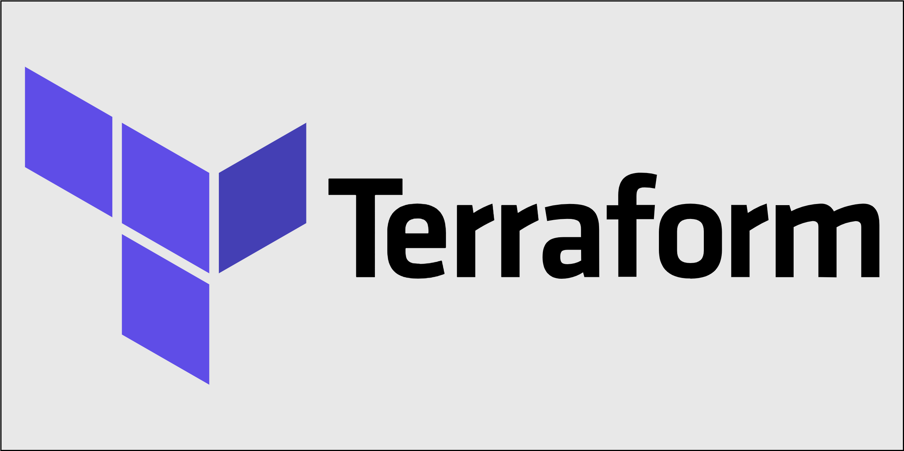
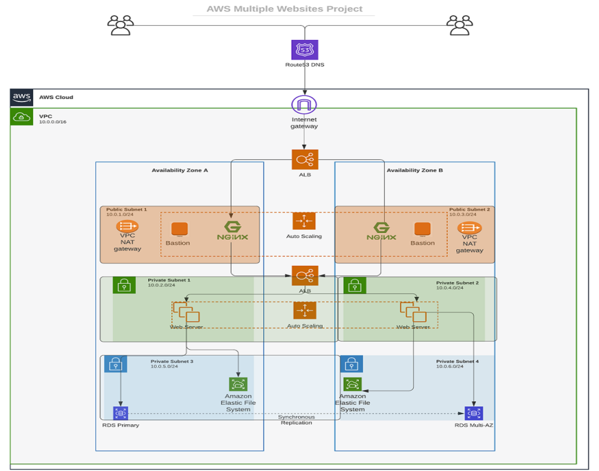
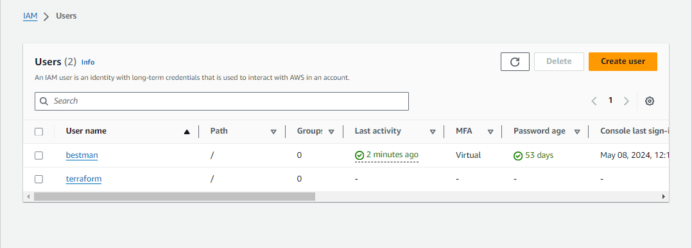
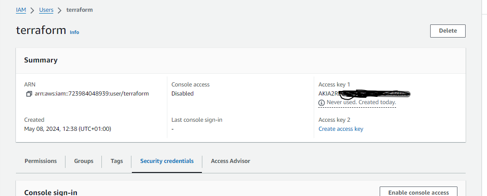

# Automating AWS Infrastructure in Code with Terraform

## Automate Infrastructure with IaC using Terraform Part I

I have built several AWS infrastructures over the course of my previous projects. Now I will be automating the process of spinning up server infrastructure using [Terraform](https://www.terraform.io/).

We will leverage the power of _Infrastructure-as-code_ to build similar setups.

### Pre-requisites before we begin writing Terraform code

    1. Terraform course completed

    2. IAM user created for programmatic access with `Administrator Access`

    3. Access key ID and secret access key ID created and saved to notepad.

    4. Install [Python SDK Boto3](https://boto3.amazonaws.com/v1/documentation/api/latest/guide/quickstart.html#installation) by reading the instructions. This will confirm python 3.8 or later is available, if not you have to install it. Then install `Boto3` by running the command `pip install boto3[crt]`.
