# Linux Commands Project

## `pwd` command

The pwd command is used to display your current working directory as show in the image below

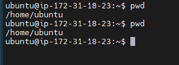

## `cd` command

The cd command is used to navigate through the Linux directories.

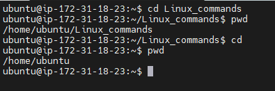

## `ls` command

ls command is used to display the list of content of a directory within a system. It has various flags that are attached to it, which enebals its various functionalities.

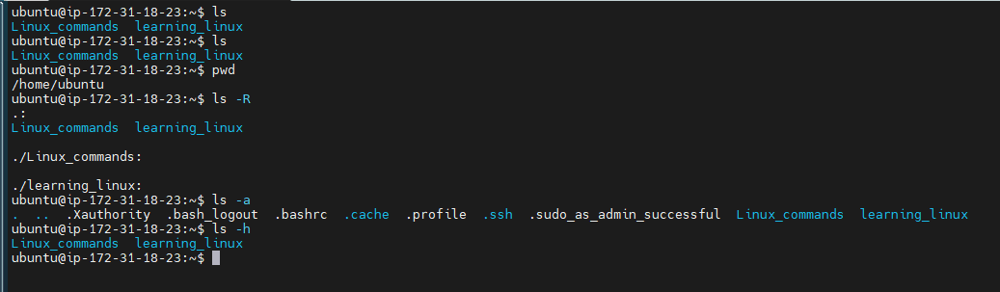

## `cat` command

The cat command is one of the most used Linux commands. It can be used to create a file, display content of a file, copy the content of one file to another file, and more

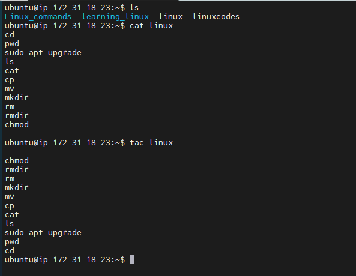

## `cp` command

cp command is used to copy files or directories and their contents

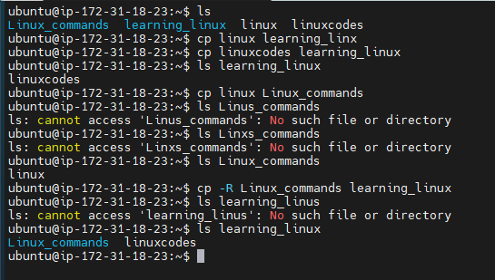

## `mv` command

The mv command is used to move a file or a directory form one location to another location. It can also be used to remane files and directories.

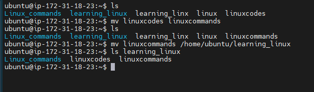

## `mkdir` command

The mkdir command is used to create one or multiple directories at once under any directory. It can also be used to set permission for the files

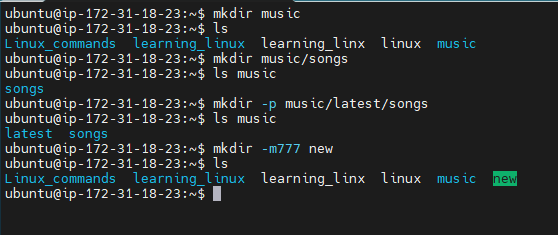

## `rm` command

rm command is used to remove a file within a directory.

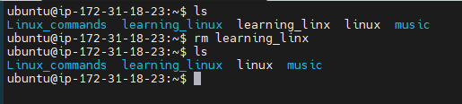

## `touch` command

The touch command allows you to create empty files.

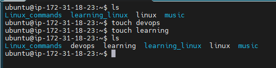

## `sudo` command

sudo is short for superuser do, it allows you to perform tasks that require administrative or root permission.

## `df` command

df command shows the system's disk space usage. It has various flags as shown in the image below.

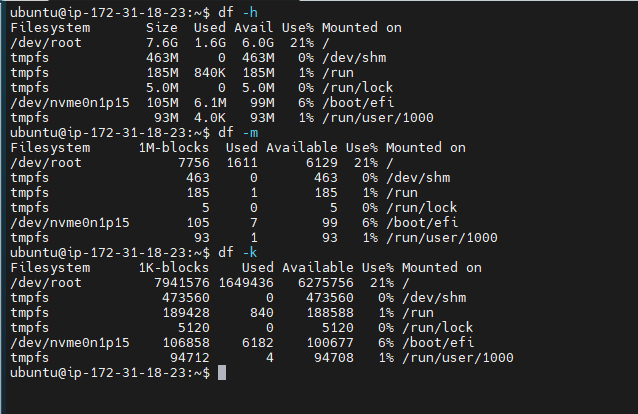

## `rmdir` command

rmdir command permanently deletes an empty directory.

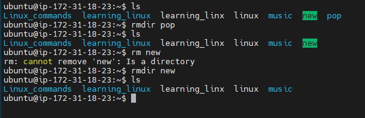

## `head` command

The head command is used to display the content of a file. It displays the first 10 lines of a file. Adding an option lets you change the number of lines shown.

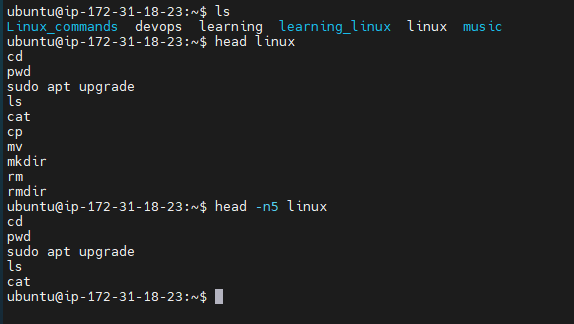

## `tail` command

The tail command is similar to the head command. The difference between both commands is that it displays the last ten lines of the file content.

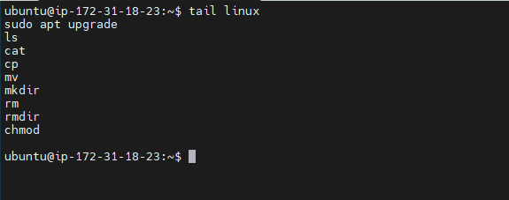

## `chmod` command

chmod command modifies a file or directory's read, write and execute permission.

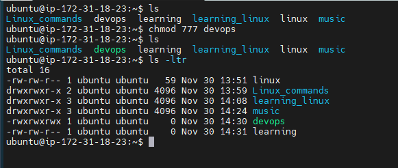

## `uname` command

This prints out the detailed information about your Linux system and hardwares.

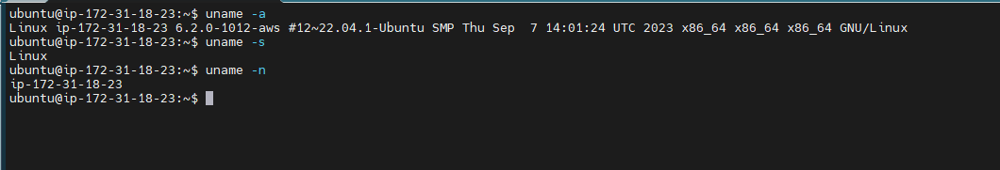

## `history` command

The history command lists previously executed commands.

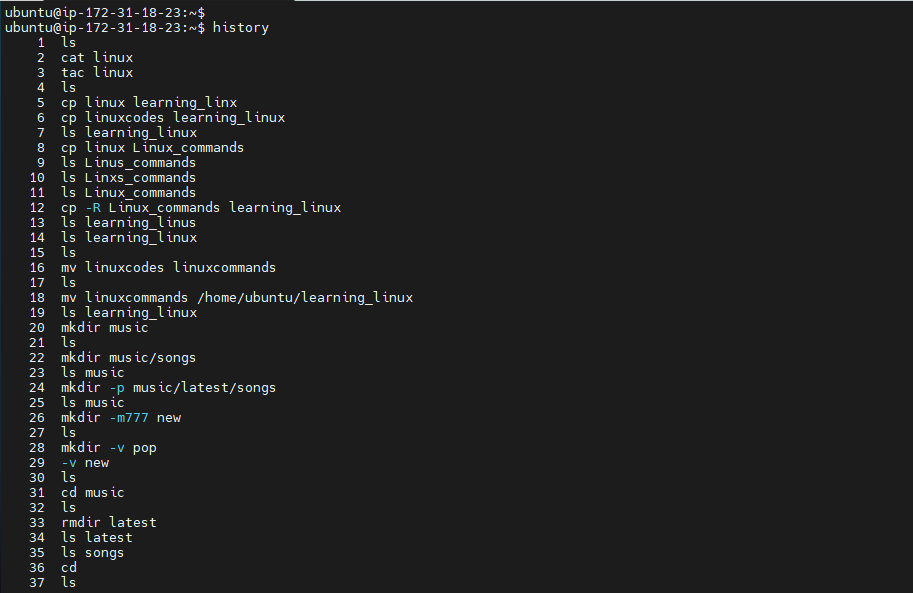

## `man` command

The man command provides a user manual of any command you can run in the terminal.

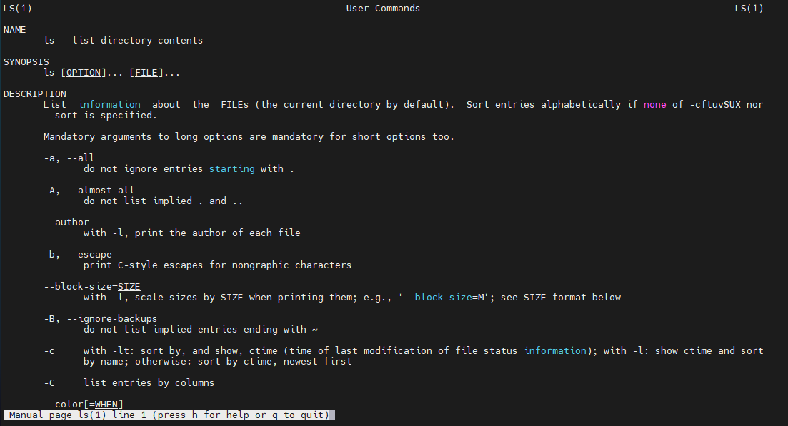

## `zip, unzip` commands

Zip command conpresses your files into a ZIP file in Linux, it helps reduce disk usgae. Unzip command unzips the file into individual files.

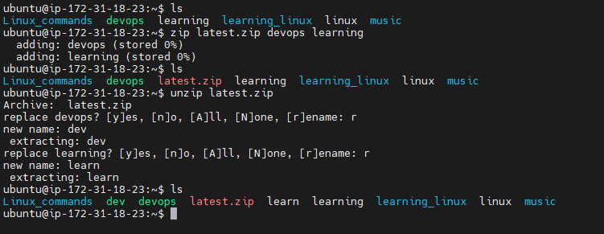

## `useradd, passwd, userdel` commands

useradd command is used to create a new account, while the passwd command is used to add a new password. userdel is used to delete a user from the Linux system.

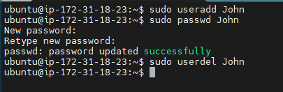
