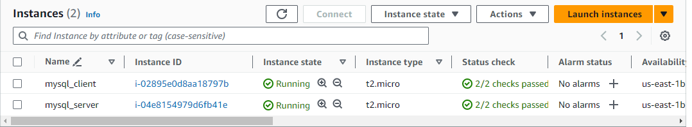

# IMPLEMENTING CLIENT-SERVER ARCHITECTURE USING MYSQL DATABASE MANAGEMENT SYSTEM (DBMS)

### Step 1: Create and configure two linux based Virtual servers (EC2 instances on AWS)

Name the 2 servers:

- Server A name `MySQL-Server` for the serving machine

* Server B name `MySQL-Client` for the requesting machine

By default both EC2 virtual servers are located in the same local virtual network. so they can communicate with eachother using using local IP address

- To use `MySQL-server` local Ip address to connect from the client

  - Create a new inbound rule to TCP to port 3306 and connect to Clients Private Ip address

- Connect to the `MySQL-Server` on your terminal and Install `MySQL software` by running the code below

`sudo apt install mysql-server`

### Step 2: Configure MySQL-Server by making the binding site opened, restarted MySQL-Server and log into MySQL

`sudo nano /etc/mysql/mysql.conf.d/mysqld.cnf`

- Replace the `Bind-address` from 127.0.0.1 to 0.0.0.0

- Restart MySQL and Login

`sudo systemctl restart mysql.service`

`sudo mysql`

### Step 3: Created a user called 'chidi' and set password and privileges to the user, checked for available users and then created a database called 'chidi' and show data base

`CREATE USER 'chidi'@'172.31.40.132' IDENTIFIED BY 'Dun-lops1';`

`grant all privileges on *.* TO 'chidi'@'172.31.40.132';`

`CREATE DATABASE chidi;`

`SHOW DATABASES;`

- To ensure the user you created is in the database, run

`select user, host FROM mysql.user;`

- To remove a user `DROP USER 'chidi'@'172.31.40.132';`

### Step 4: Go to MySQL-Client terminal and install mysql-client software on the MySQL-Client server

`sudo apt install mysql-client`

### Step 6- From MySQL-Client terminal, I connected remotely into my MySQL-Server data engine using my password and the private ip of MySQL-Server.

`mysql -u chidi -p -h 172.31.44.82`

