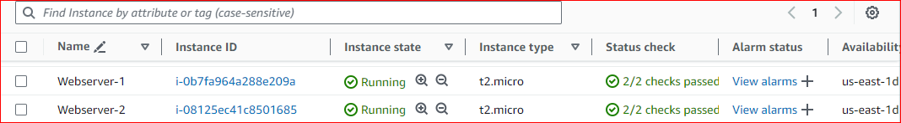
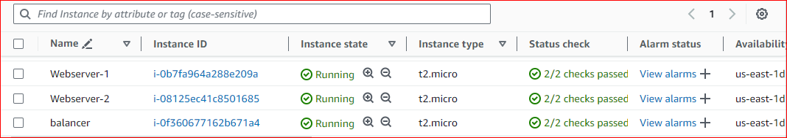

# AUTOMATING LOAD-BALANCER CONFIGURATION WITH SHELL SCRIPTING

## STEP 1: Deploying and Configuring Two Webservers

### \* Provision two EC2 instances running ubuntu 22.04.



### \* Open port 8000 to allow traffic from anywhere using the security group.


### \* Connect to the webservers via your terminal

### \* Open a file, paste the script below and close the file using the command `sudo nano install.sh`

```

#!/bin/bash

####################################################################################################################
##### This automates the installation and configuring of apache webserver to listen on port 8000
##### Usage: Call the script and pass in the Public_IP of your EC2 instance as the first argument as shown below:
######## ./install_configure_apache.sh 127.0.0.1
####################################################################################################################

set -x # debug mode
set -e # exit the script if there is an error
set -o pipefail # exit the script when there is a pipe failure

PUBLIC_IP=$1

[ -z "${PUBLIC_IP}" ] && echo "Please pass the public IP of your EC2 instance as an argument to the script" && exit 1

sudo apt update -y &&  sudo apt install apache2 -y

sudo systemctl status apache2

if [[ $? -eq 0 ]]; then
    sudo chmod 777 /etc/apache2/ports.conf
    echo "Listen 8000" >> /etc/apache2/ports.conf
    sudo chmod 777 -R /etc/apache2/

    sudo sed -i 's/<VirtualHost \*:80>/<VirtualHost *:8000>/' /etc/apache2/sites-available/000-default.conf

fi
sudo chmod 777 -R /var/www/
echo "<!DOCTYPE html>
        <html>
        <head>
            <title>My EC2 Instance</title>
        </head>
        <body>
            <h1>Welcome to my EC2 instance</h1>
            <p>Public IP: "${PUBLIC_IP}"</p>
        </body>
        </html>" > /var/www/html/index.html

sudo systemctl restart apache2

```

Webserver 1


Webserver 2


### \* Change the permission on the file to make it executable using the command `sudo chmod +x install.sh`

### \* Step 6: Run the script usinfg the command `./install.sh <PUBLIC_IP>`

Webserver 1


Webserver 2


### _script run successfully and both webservers are now active running_

### \* Both apache webservers are now serving webpages on the browser displaying their public IP addresses

Webserver 1


Webserver 2


## STEP 2: Deployment of Nginx as a Load Balancer using Shell Script

### \* We will provision a third EC2 instance running ubuntu 22.04, open port 80 to anywhere using security group and connect to the load balancer via the terminal.



### \* On your terminal, open a file called nginx.sh using the command `sudo nano nginx.sh` and post the code below

```

#!/bin/bash

######################################################################################################################
##### This automates the configuration of Nginx to act as a load balancer
##### Usage: The script is called with 3 command line arguments. The public IP of the EC2 instance where Nginx is installed
##### the webserver urls for which the load balancer distributes traffic. An example of how to call the script is shown below:
##### ./configure_nginx_loadbalancer.sh PUBLIC_IP Webserver-1 Webserver-2
#####  ./configure_nginx_loadbalancer.sh 127.0.0.1 192.2.4.6:8000  192.32.5.8:8000
#############################################################################################################

PUBLIC_IP=$1
firstWebserver=$2
secondWebserver=$3

[ -z "${PUBLIC_IP}" ] && echo "Please pass the Public IP of your EC2 instance as the argument to the script" && exit 1

[ -z "${firstWebserver}" ] && echo "Please pass the Public IP together with its port number in this format: 127.0.0.1:8000 as the second argument to the script" && exit 1

[ -z "${secondWebserver}" ] && echo "Please pass the Public IP together with its port number in this format: 127.0.0.1:8000 as the third argument to the script" && exit 1

set -x # debug mode
set -e # exit the script if there is an error
set -o pipefail # exit the script when there is a pipe failure


sudo apt update -y && sudo apt install nginx -y
sudo systemctl status nginx

if [[ $? -eq 0 ]]; then
    sudo touch /etc/nginx/conf.d/loadbalancer.conf

    sudo chmod 777 /etc/nginx/conf.d/loadbalancer.conf
    sudo chmod 777 -R /etc/nginx/


    echo " upstream backend_servers {

            # your are to replace the public IP and Port to that of your webservers
            server  "${firstWebserver}"; # public IP and port for webserser 1
            server "${secondWebserver}"; # public IP and port for webserver 2

            }

           server {
            listen 80;
            server_name "${PUBLIC_IP}";

            location / {
                proxy_pass http://backend_servers;
            }
    } " > /etc/nginx/conf.d/loadbalancer.conf
fi

sudo nginx -t

sudo systemctl restart nginx

```


### \* Change the permission of the file to make it an executable file using the command `sudo chmod +x nginx.sh`

### \* Run the script with the command `./nginx.sh PUBLIC_IP Webserver-1 Webserver-2`

### Example of the code `./nginx.sh 52.201.216.208 44.205.253.176:8000 18.212.24.207:8000`


### _script run successfully and NGINX Load Balancer is now active running_

### _You can see from the below screenshot the Nginx webserver configured as a load balancer is serving the webpage of Webserver 1_


### _And when refreshed the Nginx load balancer serves the webpage of Webserver 2_


# The Automation of NGINX Load Balancer was Successful
